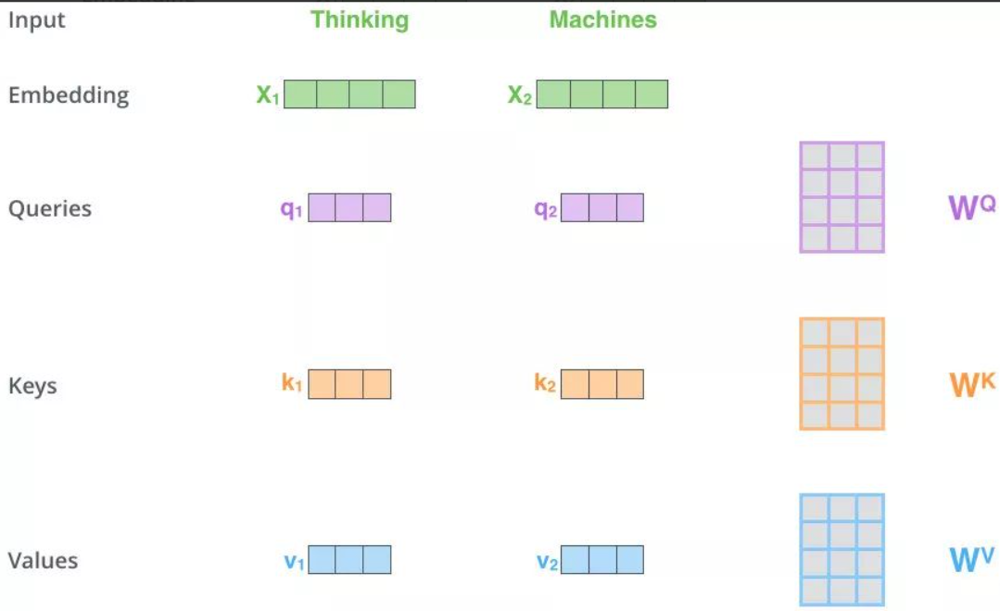
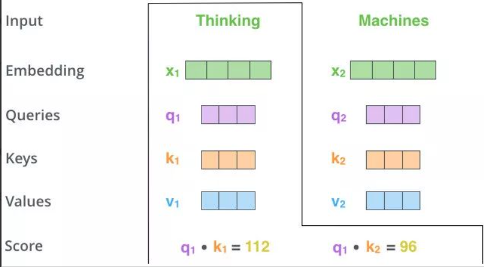
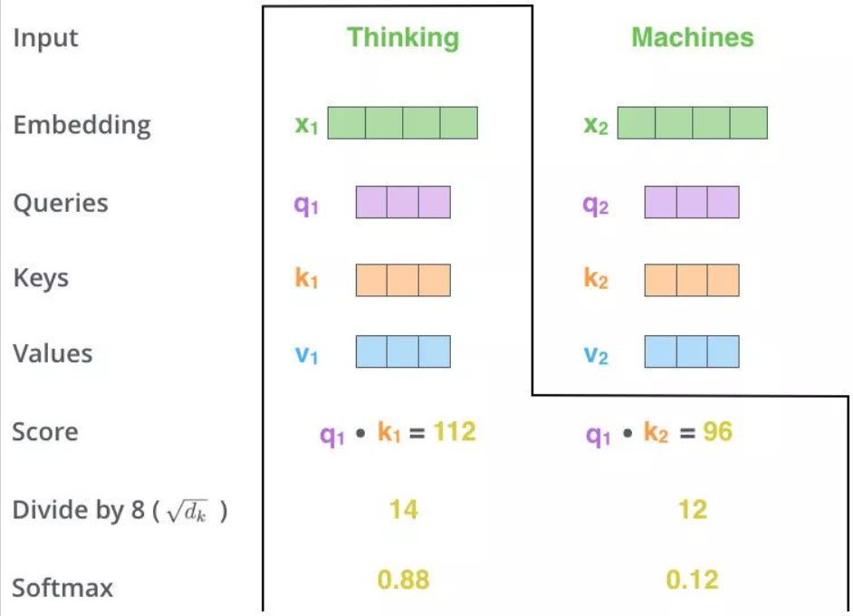
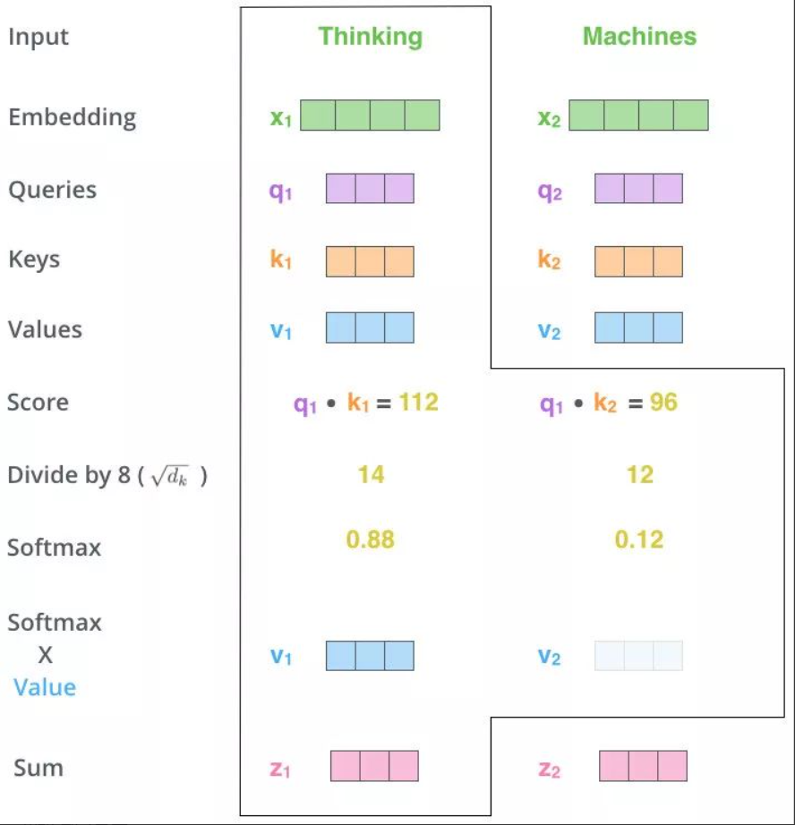
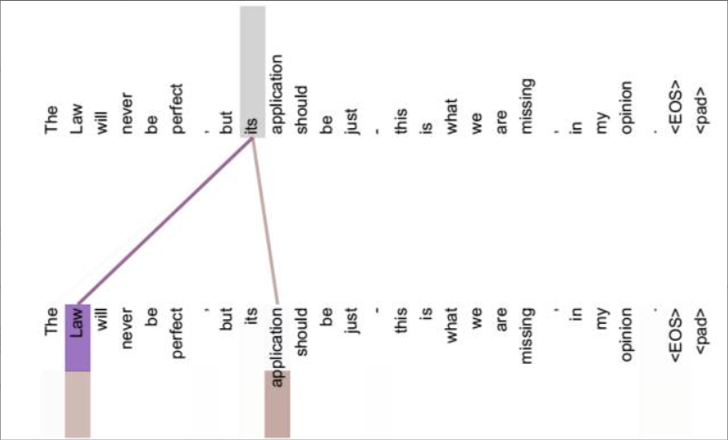
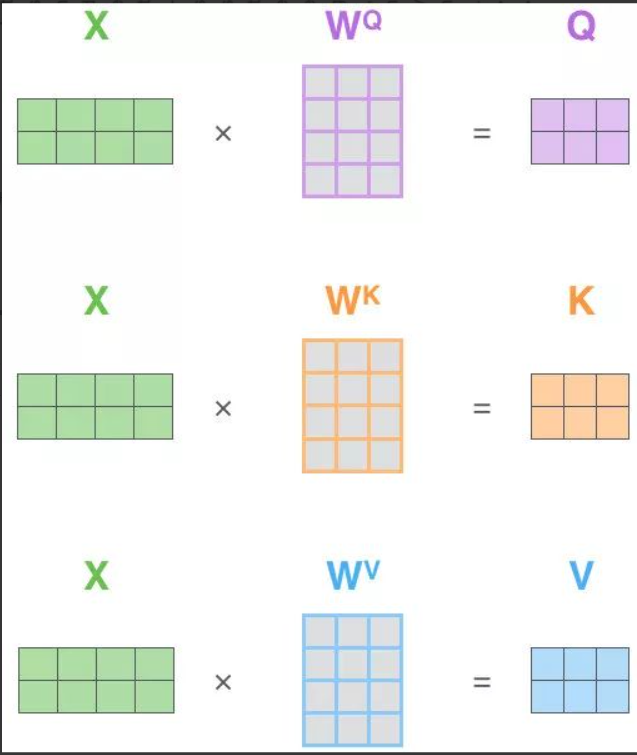
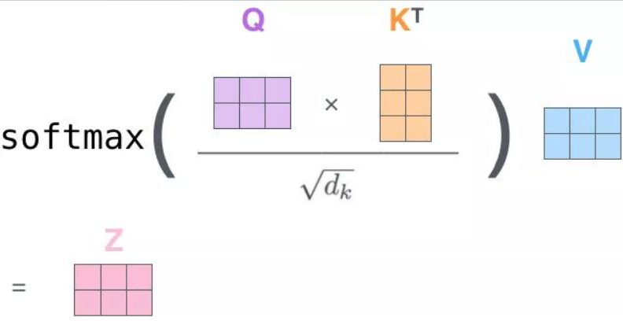

# Self-Attention(自注意力机制)

自-注意力机制（Self-Attention）（向量）
===========================

Self-Attention 的关键点再于，不仅仅是 K≈V≈Q 来源于同一个 X，这三者是同源的

通过 X 找到 X 里面的关键点

并不是 K=V=Q=X，而是通过三个参数 WQ,WK,WV

接下来的步骤和注意力机制一模一样

1. Q、K、V的获取

2. Matmul：

3. Scale+Softmax：

4. Matmul：

$z_1$表示的就是 thinking 的新的向量表示

对于 thinking，初始词向量为$x_1$

现在我通过 thinking machines 这句话去查询这句话里的每一个单词和 thinking 之间的相似度

新的$z_1$依然是 thinking 的词向量表示，只不过这个词向量的表示蕴含了 thinking machines 这句话对于 thinking 而言哪个更重要的信息

不做注意力，its 的词向量就是单纯的 its，没有任何附加信息

**也就是说 its 有 law 这层意思，而通过自注意力机制得到新的 its 的词向量，则会包含一定的 laws 和 application 的信息**

## 自注意力机制（矩阵）

