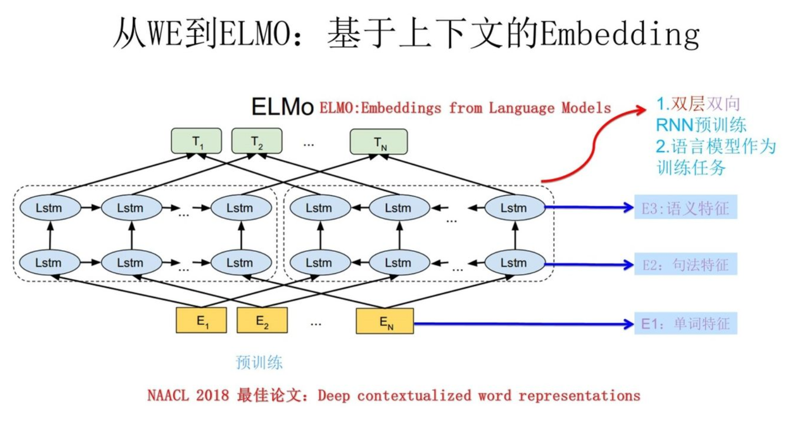

## Word2Vec模型

**NNLM模型（预测下一个词，副产品是词向量）**

#### word2vec模型：专门做词向量

1.CBOW

2.Skip-gram

# ELMO

ELMo（专门做词向量，通过预训练）

不只是训练一个 Q 矩阵，我还可以把这个次的上下文信息融入到这个 Q 矩阵中

左边的 LSTM 获取 E2 的上文信息，右边就是下文信息

x1,x2, x4,x5 --> Word2Vec x1+x2+x4+x5 ---> 预测那一个词

获取上下文信息后，把三层的信息进行一个叠加

E1+E2+E3 = K1 一个新的词向量 ≈ E1

E2,E3 相当于两个上下文信息

E1+E2+E3+E4

K1 包含了第一个词的词向量包含单词特征、句法特征、语义特征

怎么用

E2，E3 不同，E1+E2+E3 不同

apple --》 我吃了一个 苹果 -- 》 [1,20,10]

apple --》我在用苹果手机 --》[1,10,20]

LSTM 无法并行，长期依赖

Attention

[Transformer、GPT、BERT，预训练语言模型的前世今生（目录） - 二十三岁的有德 - 博客园 (cnblogs.com)](https://www.cnblogs.com/nickchen121/p/15105048.html)