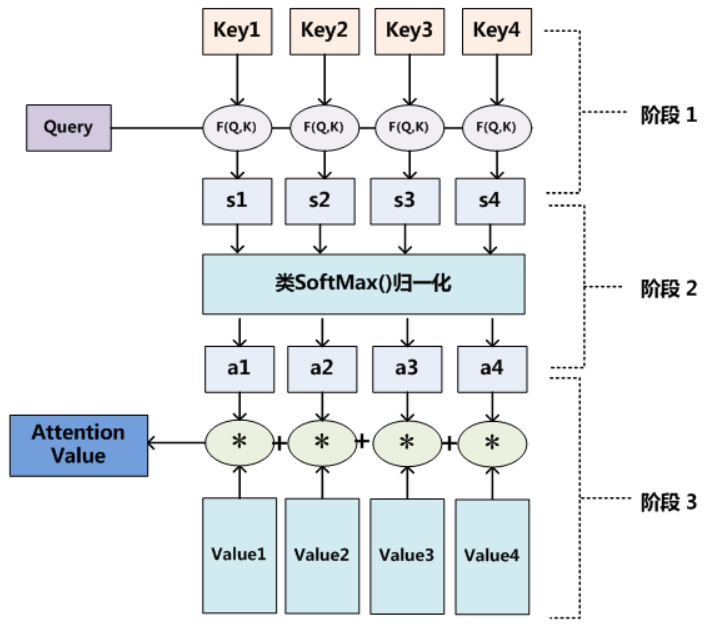

# Attention(注意力机制)

## 怎么做注意力？

我（查询对象Q） 这张图（被查询对象 V）

计算Q和V里的事物的重要度

Q，$K = k_1, k_2, \cdots,k_n,$ 一般使用点乘的方式

通过点乘的方法计算Q 和 K 里的每一个事物的相似度，就可以拿到 Q 和$k_1$的相似值$s_1$，Q 和$k_2$的相似值$s_2$，Q 和$k_n$的相似值$ s_n$

做一层$softmax(s_1, s_2, \cdots, s_n)$ 就得到概率$(a_1, a_2, \cdots, a_n)$

进而就找到哪个对于Q而言很重要了

我们还得进行一个汇总，当你使用 Q 查询结束了后，Q 已经失去了它的使用价值了，我们最终还是要拿到这张图片的，只不过现在的这张图片，它多了一些信息（多了于我而言更重要，更不重要的信息在这里）

V = $(v_1, v_2, \cdots, v_n)$

$(a_1, a_2, \cdots, a_n)$* + $(v_1, v_2, \cdots, v_n)$ = $(a_1 * v_1 + a_2 * v_2 + \cdots + a_n * v_n)$ = V'

这样的话，就得到了一个新的 V'，这个新的 V' 就包含了，哪些更重要，哪些不重要的信息在里面，然后用 V' 代替 V

一般 K=V，在 Transformer 里，K!=V 可不可以，可以的，但是 K 和 V 之间一定具有某种联系，这样的 QK 点乘才能指导 V 哪些重要，哪些不重要

51， 49---》 0.51，0.49

80/8，20/8 --》 0.9999999999， 0.0000000001

### 10 / 3 --> 0.9, 0.1

a1 和 a2 之间的差额越大，这个概率就越离谱

[Transformer、GPT、BERT，预训练语言模型的前世今生（目录） - 二十三岁的有德 - 博客园 (cnblogs.com)](https://www.cnblogs.com/nickchen121/p/15105048.html)