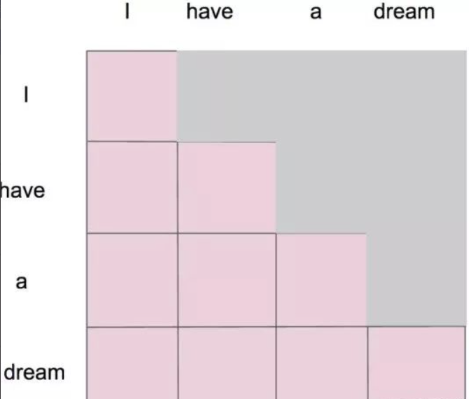

# Masked Self-Attention

### Masked（掩码） Self-Attention-->在自注意力模型上面做了改进

为什么要做这个改进：生成模型，生成单词，一个一个生成的

当我们做生成任务的时候，我们也想对生成的这个单词做注意力计算，但是，生成的句子是一个一个单词生成的

I have a dream

1. I 第一次注意力计算，只有 I

2. I have 第二次，只有 I 和 have

3. I have a

4. I have a dream

5. I have a dream <eos>

掩码自注意力机制应运而生

掩码后 1

掩码后 2

