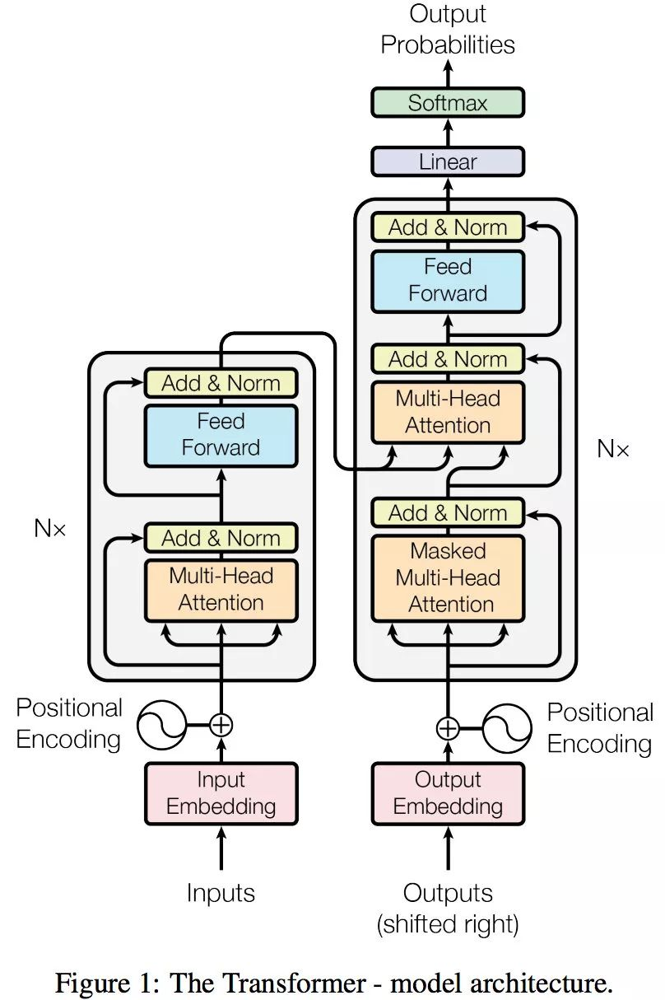
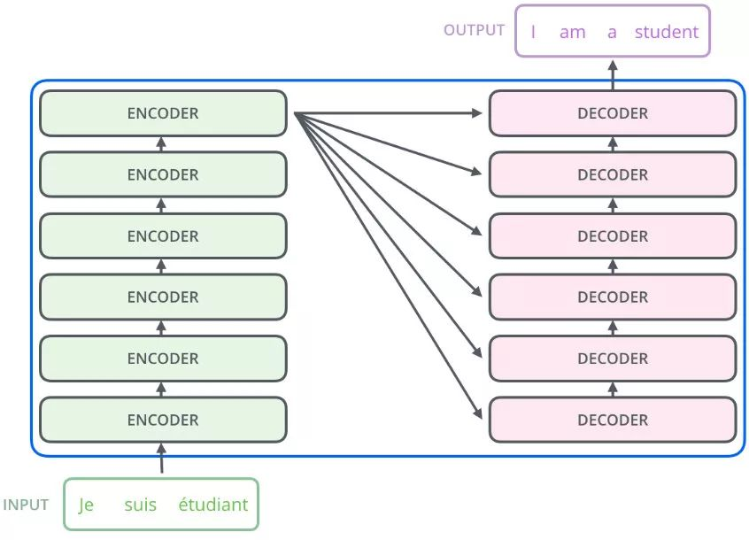

# Transformer 框架

预训练--》NNLM--》word2Vec--》ELMo--》Attention

NLP 中预训练的目的，其实就是为了生成词向量

顺水推舟，transformer 其实就是 attention 的一个堆叠

从一个宏观的角度，去看 transformer 到底在干嘛，然后在细分，再作总结

总分总

seq2seq

一句话，一个视频

序列（编码器）到序列（解码器）

分成两部分，编码器和解码器

整体框架
====

机器翻译流程（Transformer）
===================

通过机器翻译来做解释

给一个输入，给出一个输出（输出是输入的翻译的结果）

“我是一个学生” --》（通过 Transformer） I am a student

流程 1

编码器和解码器

编码器：把输入变成一个词向量（Self-Attetion）

解码器：得到编码器输出的词向量后，生成翻译的结果

流程 2

Nx 的意思是，编码器里面又有 N 个小编码器（默认 N=6）

通过 6 个编码器，对词向量一步又一步的强化（增强）

流程 3

说了这么多，了解 Transformer 就是了解 Transformer 里的小的编码器（Encoder）和小的解码器（Decoder）

FFN（Feed Forward）：w2(（w1x+b1）)+b2

流程 4

[Transformer、GPT、BERT，预训练语言模型的前世今生（目录） - 二十三岁的有德 - 博客园 (cnblogs.com)](https://www.cnblogs.com/nickchen121/p/15105048.html)

---

