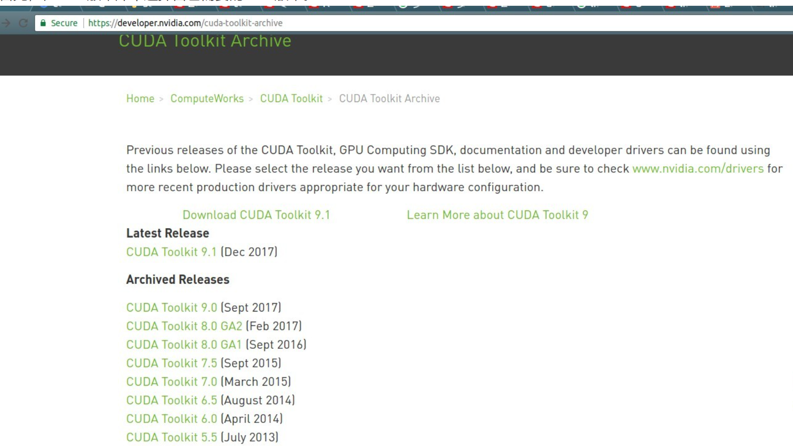
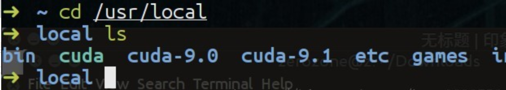

# 在ubuntu上安装多个版本的CUDA，并且可以随时切换

CUDA是什么就不介绍了，直接讲怎么实现CUDA多版本的共存和实时切换。

## 1、安装多个版本的CUDA

这里，我们以cuda9-1版本和cuda9-0版本为例（先安装哪个无所谓）
首先，在cuda版本库中选择自己需要的cuda版本。



然后，选择对应的安装包，**这里选择runfile类型的安装文件**，以便后面设置每个cuda的安装路径。


下载完成以后，我们利用cd命令，进入到cuda_8.0.61_375.26_linux.run文件所在的目录中，然后运行下面的指令，进行安装（注意这个文件名，前面的cuda_8.0.61代表cuda的版本，后面的375.26代表的对应的NVIDIA驱动的版本，这里我用cuda8.0的安装过程为例，9.0和9.1同理）

安装过程中在建立软链接时需要注意一下，如果你是第一次安装cuda，那么毫无疑问输入y（yes），但是如果你是安装额外版本的cuda，是否选择y（yes）就要看你的具体需求而定，简言之，就是如果你希望启用当前安装的cuda版本，就选y，如果你只是想安装这个版本，而暂时还不想启用该版本时，就选n。

```
#先执行下面的命令安装相关依赖，
#否则会出现`Missing recommended library`错误
sudo apt-get install freeglut3-dev build-essential libx11-dev libxmu-dev libxi-dev libgl1-mesa-glx libglu1-mesa libglu1-mesa-dev 


sudo sh cuda_8.0.61_375.26_linux.run #开始安装

#..一堆协议说明...
#直接按q退出协议说明.
zerozone@zerozone: accept/decline/quit: accept  #接受协议

Install NVIDIA Accelerated Graphics Driver for Linux-x86_64 375.26? 
y)es/(n)o/(q)uit: n  #是否显卡驱动包，由于已经安装显卡驱动，选择n

Install the CUDA 8.0 Toolkit?
(y)es/(n)o/(q)uit: y #是否安装工具包，选择y

Enter Toolkit Location
[ default is /usr/local/cuda-8.0 ]: #工具包安装地址，默认回车即可

Do you want to install a symbolic link at /usr/local/cuda?
(y)es/(n)o/(q)uit: y #添加链接**注意这个连接，如果你之前安装过另一个版本的cuda，除非你确定想要用这个新版本的cuda，否则这里就建议选no，因为指定该链接后会将cuda指向这个新的版本**

Install the CUDA 8.0 Samples?
(y)es/(n)o/(q)uit: y #安装样例

Enter CUDA Samples Location
 [ default is /root ]:  #样例安装地址默认即可

# ***安装信息***
Installing the CUDA Toolkit in /usr/local/cuda-8.0 ...

Missing recommended library: libXi.so
Missing recommended library: libXmu.so
#注意，这里出现了Missing recommended library错误，
#是因为博主在第一次安装时，没有添加最开始的那条安装相关依赖的指令，
#之后我添加了依赖后，再次安装，就没有Missing错误了

Installing the CUDA Samples in /root ...
Copying samples to /root/NVIDIA_CUDA-8.0_Samples now...
Finished copying samples.

===========
= Summary =
===========
Driver:   Not Selected
Toolkit:  Installed in /usr/local/cuda-8.0
Samples:  Installed in /root, but missing recommended libraries

Please make sure that
 -   PATH includes /usr/local/cuda-8.0/bin
 -   LD_LIBRARY_PATH includes /usr/local/cuda-8.0/lib64, or, add /usr/local/cuda-8.0/lib64 to /etc/ld.so.conf and run ldconfig as root

To uninstall the CUDA Toolkit, run the uninstall script in /usr/local/cuda-8.0/bin

Please see CUDA_Installation_Guide_Linux.pdf in /usr/local/cuda-8.0/doc/pdf for detailed information on setting up CUDA.

***WARNING: Incomplete installation! This installation did not install the CUDA Driver. A driver of version at least 361.00 is required for CUDA 8.0 functionality to work.

To install the driver using this installer, run the following command, replacing <CudaInstaller> with the name of this run file:

    sudo <CudaInstaller>.run -silent -driver

Logfile is /tmp/cuda_install_6388.log   
# ***安装完成***
```

配置CUDA相关环境变量
修改~/.bashrc文件（或~/.zhsrc） 在文件末尾添加环境变量

```
Tensorflow官方安装历程要求注意的是:配置PATH和LD_LIBRARY_PATH和CUDA_HOME环境变量.

vim ~/.bashrc #修改配置文件（如果你用的是zsh，则需要修改 ~/.zshrc文件）

#在文件结尾处添加
export LD_LIBRARY_PATH=$LD_LIBRARY_PATH:/usr/local/cuda/lib64
export PATH=$PATH:/usr/local/cuda/bin
export CUDA_HOME=$CUDA_HOME:/usr/local/cuda

```

利用同样的方法下载你想安装的另一个版本的cuda工具包（注意是run[file类](https://so.csdn.net/so/search?q=file类&spm=1001.2101.3001.7020)型），在安装过程中，注意cuda symbol link的选择（首次安装，选y，安装额外的版本，选n）

## 2、cuda多个版本的切换

在安装了多个cuda版本后，可以在`/usr/local/`目录下查看自己安装的cuda版本，如下图所示：



这里，cuda-9.0和cuda-9.1就是我们安装的两个cuda版本了，而cuda是一个软链接，它指向我们指定的cuda版本（注意上面在设置环境变量时，使用的是cuda，而不是cuda-9.0和cuda-9.1，这主要是为了方便我们切换cuda版本，可以让我们不用每次都去该环境变量的值）

可以使用stat命令查看当前cuda软链接指向的哪个cuda版本，如下所示：


可以看到，文件类型是symbolic link，而指向的目录正是`/usr/local/cuda-9.0`，当我们想使用cuda-9.1版本时，只需要删除该软链接，然后重新建立指向cuda-9.1版本的软链接即可（注意名称还是cuda，因为要与`bashrc`文件里设置的保持一致）

```
sudo rm -rf cuda
sudo ln -s /usr/local/cuda-9.1 /usr/local/cuda
```

想切换其他版本的cuda，只需要改动建立软链接时cdua的正确路径即可